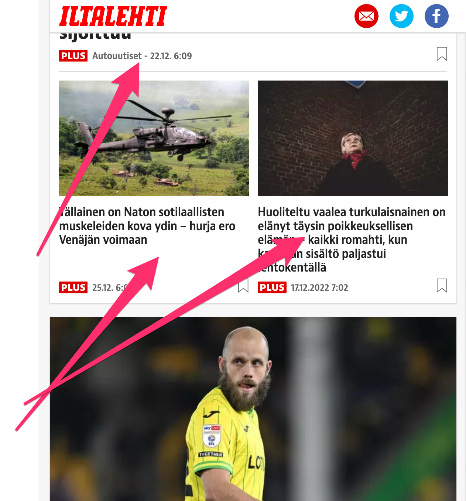
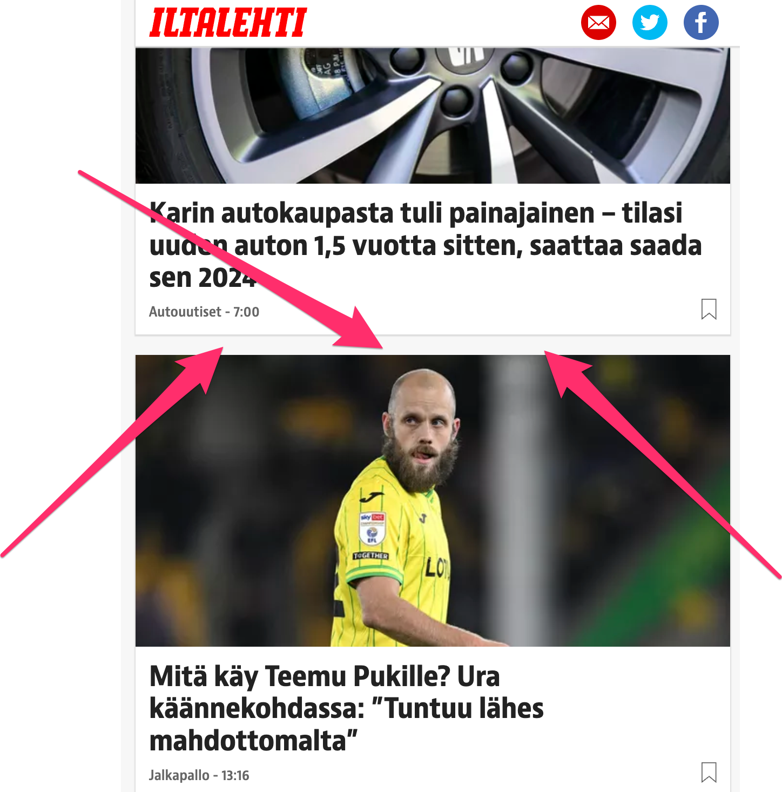

<h1>Iltalehti plus -adblocker</h1>

Chrome extension that automatically hides Iltalehti plus -ads on <a href="https://www.iltalehti.fi/">iltalehti.fi.</a>

Usage guide

1. Clone this repository
2. Using Google Chrome, navigate to chrome://extensions/
3. Select load unpacked on the top right
4. Unpack the extension folder
5. Check that the extension is activated

Note: Changes to the iltalehti.fi-website might cause this extension to become deprecated, but for now it works really well :)

<h3>Before</h3>

<h3>After</h3>

